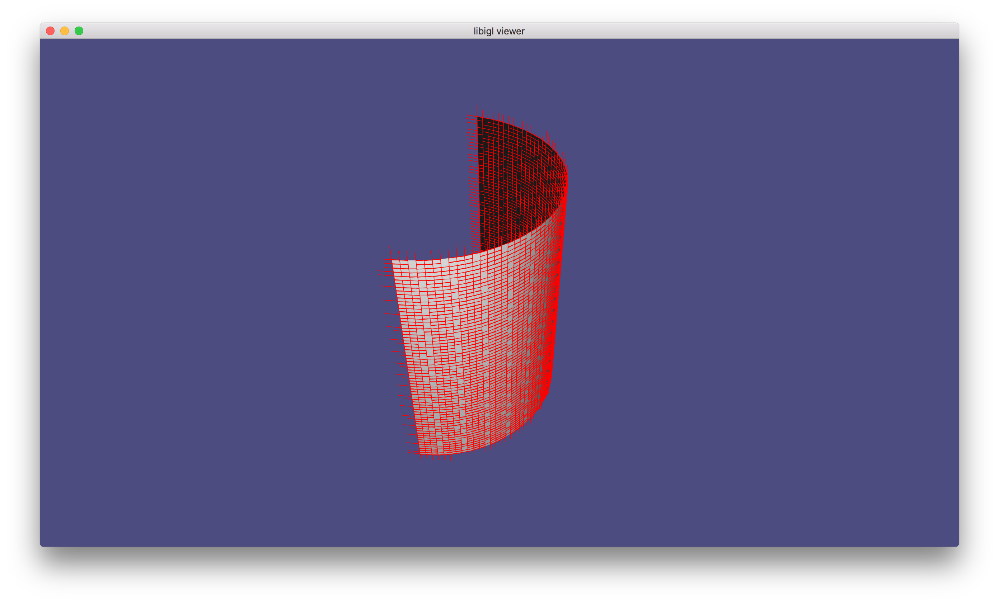
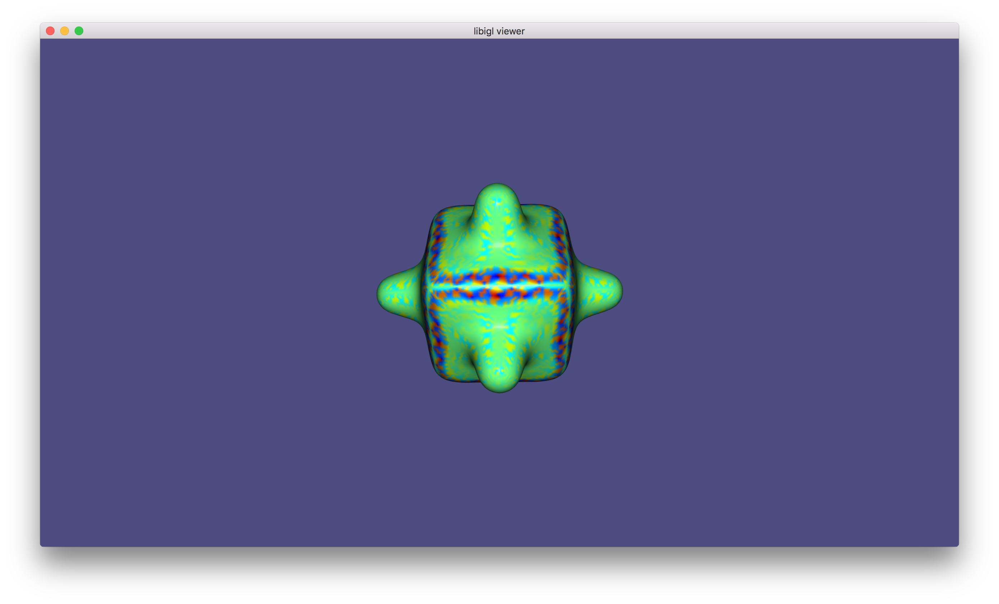
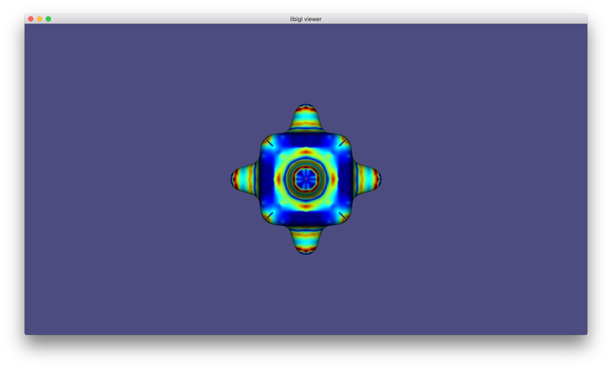
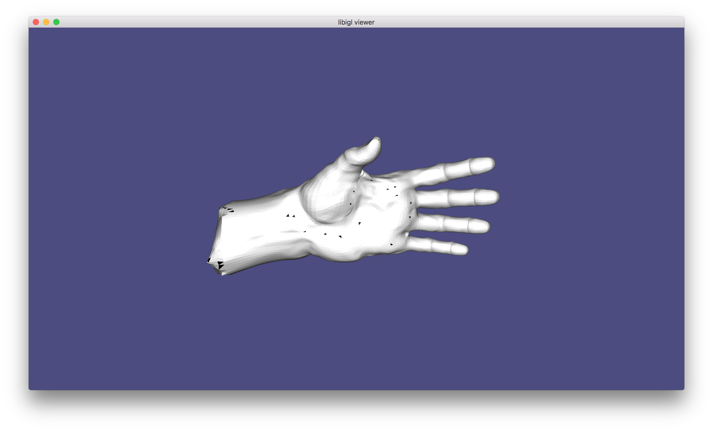
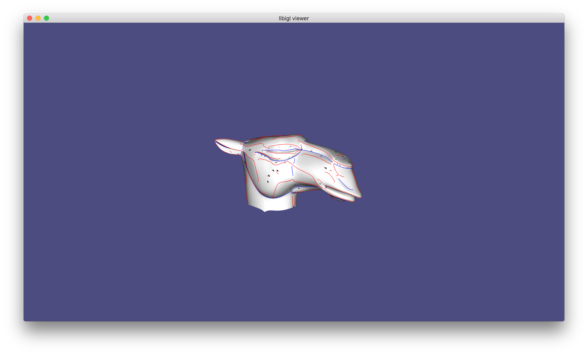
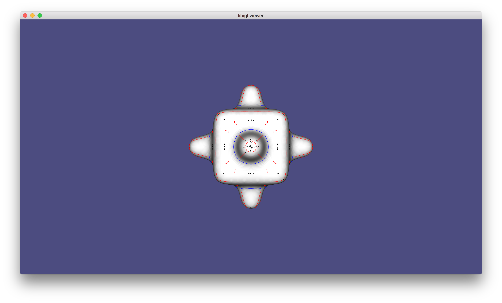
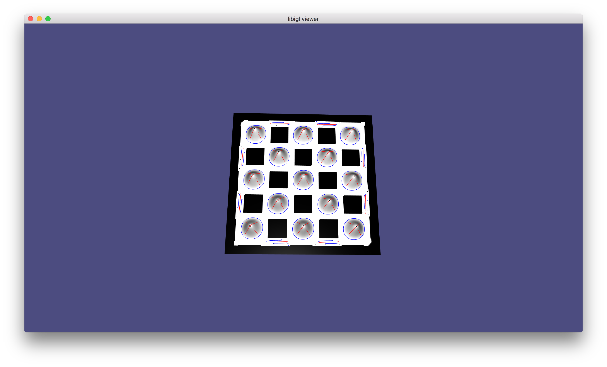

# Smooth Feature Lines on Surface Meshes
## -- based on the paper by K. Hildebrandt, K. Polthier and M. Wardetzky

### Background
Feature lines on a mesh carry the visually most prominent characteristics of the mesh. This paper introduces a way to detect the feature lines on a mesh based on utilizing discrete differential operators on piecewise linear meshes.

### Objective
- Detect “salient ridges” on meshes
- Compute points with extreme principal curvatures
  - Under certain conditions, these form feature curves
  - Checking these conditions requires computing 1st and 2nd derivatives of curvatures

### Procedures
- Compute principal curvatures
- Compute discrete extremalities
- Smooth discrete extremalities
- Determine regularity for each triangle
- Trace feature lines in regular triangles
- Process singular triangles

### Library used
- Libigl

### Results
- Direction of principal curvatures on a half cylinder
  
- Color map of the extramalities on a bumpy cube
  - e max (absolute values)
    
  - e min (absolute values)
    
- Singular triangles on a hand
  
- Feature lines
  - on a camel head
  
  - on a bumpy cube
  
  - on a bumpy plane
  

### Todo
- Remove small ridges by a threshold
